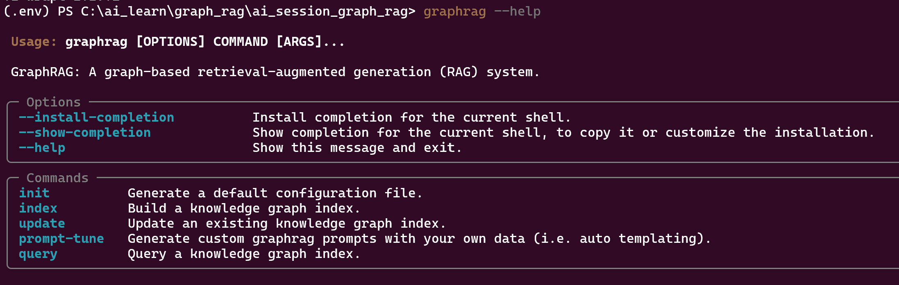

# ai_session_graph_rag

- python -m virtualenv .env  

- .\\.env\Scripts\activate  

- pip install -r .\requirements.txt  

    

- graphrag init --root ./ragtest

- update env file

- update settings.yaml

- graphrag init --root .\zerodha_daily_brief

- graphrag prompt-tune --root .\zerodha_daily_brief --config .\zerodha_daily_brief\settings.yaml --selection-method auto --k 8 --discover-entity-types --output .\zerodha_daily_brief\auto_tuned_prompt

- update path of prompts for entity_extraction, summarize_descriptions and community_reports in settings.yaml

- graphrag index --root .\zerodha_daily_brief

- graphrag query --root .\zerodha_daily_brief --method "global" --query "can trump tariffs break global economy?"

- graphrag query --root .\zerodha_daily_brief --method "global" --query "how is pencil manufactured?"

- graphrag query --root .\zerodha_daily_brief --method "local" --query "how is pencil manufactured?"